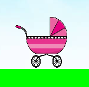
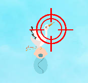
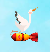
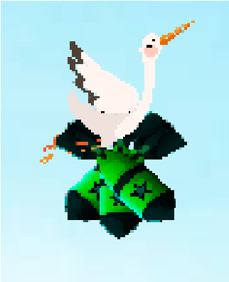
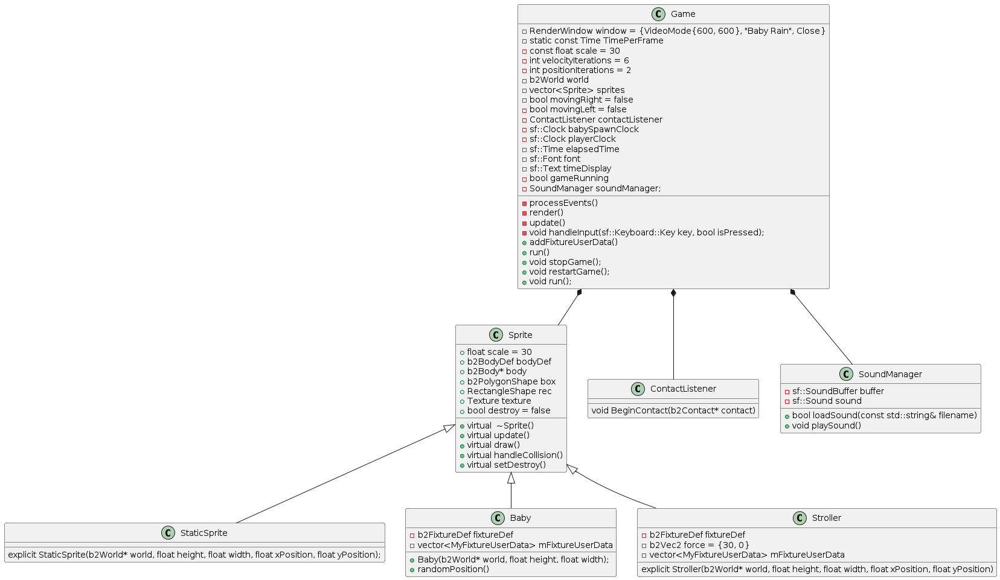

# BabyRain

Binôme:
* Alexandre LECONTE
* Juliette BOURDIAU

# Mécanique principale du jeu
L'objectif est d'attrapper les bébés portées par le cygognes avec la poussette avant qu'ils atteignent le sol. Attention aux cygognes piégées !!

Pour faire recommencer le jeu, il faut appuyer sur la touche R (restart).

## La poussette
Le mouvement de la poussette est contrôlé par les touches Q (mouvement vers la gauche) et D (mouvement vers la droite).

## Les Cygognes classiques
Pour récupérer les bébés, il faut shooter les cygognes en cliquant dessus. Un bébé qui tombe au sol fait automatiquement perdre la partie.

## Les Cygnognes piégées
Les cygognes piégées portent des bombes qui sont larguées aléatoirement. Ces cygognes ne sont pas cliquables. Si les dégats des bombes font tomber le score à 0, la partie est finie.

### Bombe simple
Les bombes simples font un dégats de trois points. Il est possible de les éviter en les laissant tomber au sol ou de cliquer dessus une fois largués pour ne pas encaisser de dégats.

### Triplet de bombes
Le triplet de bombes infligent un point de dégats. Pour éviter les dégats, c'est le même mécanisme que les bombes simples.

# Conception

## Diagramme de classe

# Bibliothèques externes

## [SFML](https://www.sfml-dev.org/)
Pour gérer la partie graphique et les interactions avec l'utilisateur dans le jeu.

## [Box2D](https://box2d.org/)
Permet d'utiliser des propriétés physiques dans le jeu.
1 unité sur Box2D correspond à 30 pixels dans SFML.